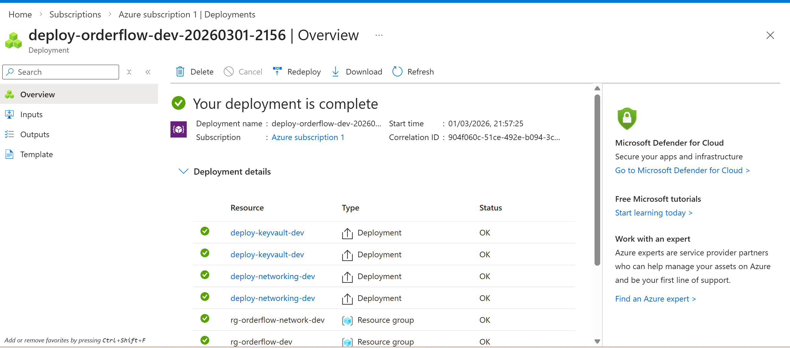
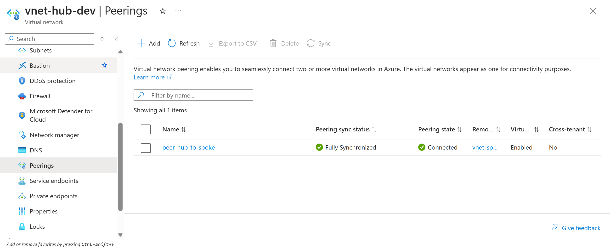
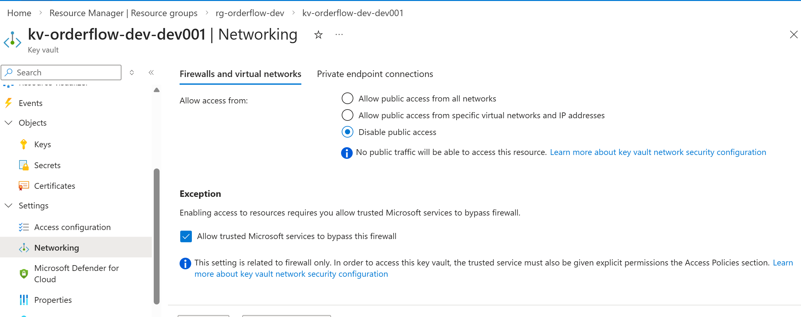
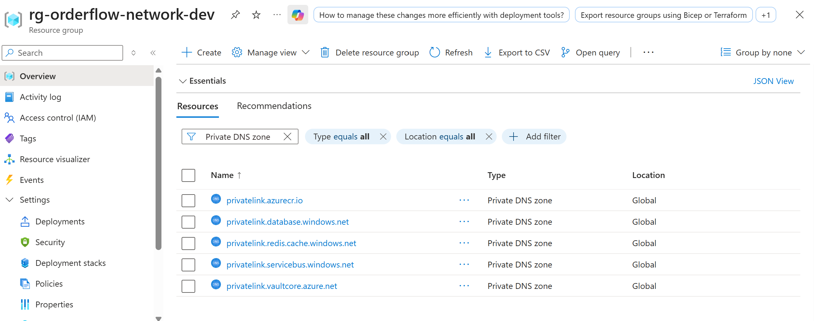
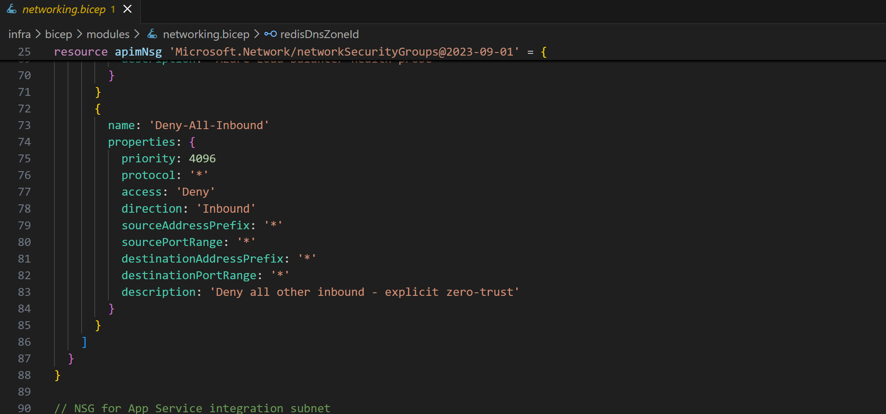

# OrderFlow API Platform Governance Accelerator

> **A principal-level Azure architecture portfolio project** demonstrating secure, governed API modernisation — from legacy monolith to Azure-native platform with zero-trust networking, DevSecOps automation, and full observability.

[](LICENSE)
[](https://learn.microsoft.com/azure/azure-resource-manager/bicep/)
[](https://azure.microsoft.com)
[](https://learn.microsoft.com/azure/well-architected/)

---

## Table of Contents

- [Business Context](#business-context)
- [Architecture Overview](#architecture-overview)
- [Azure Well-Architected Framework Alignment](#azure-well-architected-framework-alignment)
- [Repository Structure](#repository-structure)
- [Architecture Decision Records](#architecture-decision-records)
- [Prerequisites](#prerequisites)
- [Step-by-Step Deployment Guide](#step-by-step-deployment-guide)
  - [Phase 1 — Environment Setup](#phase-1--environment-setup)
  - [Phase 2 — Networking and Key Vault](#phase-2--networking-and-key-vault)
  - [Phase 3 — Monitoring and App Service](#phase-3--monitoring-and-app-service)
  - [Phase 4 — API Management](#phase-4--api-management)
  - [Phase 5 — Application and Data Tier](#phase-5--application-and-data-tier)
  - [Phase 6 — DevSecOps Pipeline](#phase-6--devsecops-pipeline)
- [Cost Estimates](#cost-estimates)
- [Cleanup](#cleanup)
- [Contributing](#contributing)

---

## Business Context

**The problem this solves:**

Contoso Manufacturing runs a monolithic Order Management System (OMS) on-premises with:

- No API governance — different auth mechanism per consuming team
- Zero observability — 4-hour mean time to detect (MTTD) for incidents
- Manual deployments — 6-hour maintenance windows, high change failure rate
- API keys stored in config files — violates ISO 27001 controls
- No network segmentation — a compromised service can reach everything
- Cannot scale — seasonal 10x traffic spikes cause outages

**What this platform delivers:**

A secure, governed Azure-native API platform where:

- Every API call flows through **Azure API Management** — single enforcement point for auth, rate limiting, and OWASP mitigations
- **Zero public backend IPs** — all services sit inside a hub-spoke VNet with private endpoints
- **Entra ID** handles all authentication (client credentials for B2B, auth code + PKCE for users)
- **Managed Identity** replaces every stored credential — no secrets in code or config
- Full platform provisioned in **under 10 minutes** via modular Bicep IaC
- **5-gate DevSecOps pipeline** — CodeQL, Snyk, Trivy, DAST, blue-green deploy with auto-rollback

---

## Architecture Overview

### High-Level Architecture


*Figure 1: Hub-spoke zero-trust network topology. All external traffic enters via Azure Front Door → Azure Firewall → APIM (internal VNet mode) → App Service (VNet-integrated). No backend service has a public IP.*

### Security and Identity Flow


*Figure 2: Three auth flows — B2B client credentials, SPA auth code + PKCE, and service-to-service Managed Identity. APIM validates every JWT and strips it before forwarding to the backend, which only ever sees enriched headers.*

### DevSecOps CI/CD Pipeline


*Figure 3: Five mandatory security gates before production. Blue-green slot swap with automated health check and instant rollback. OIDC federated login — no service principal secrets stored anywhere.*

### Disaster Recovery Topology


*Figure 4: Warm standby in paired region (East US 2 → Central US). RTO < 15 min for app tier, < 60 min full platform. SQL geo-replication with < 5s RPO. DR cost = 25% of primary.*

---

## Deployed Infrastructure — Phase by Phase

### Phase 2: Networking and Key Vault


*Screenshot 1: Azure portal showing deployment `deploy-orderflow-dev-20260301-2156` in Succeeded state. All 20+ resources provisioned via a single `az deployment sub create` command.*

---


*Screenshot 2: VNet peering between `vnet-hub-dev` and `vnet-spoke-dev` showing `Connected` and `FullyInSync` state. Hub grants gateway transit so all spoke egress routes through Azure Firewall — the core of ADR-003 zero-trust enforcement.*

---


*Screenshot 3: Key Vault networking tab showing `Public network access: Disabled`. The only route into this Key Vault is via the private endpoint `pe-kv-orderflow-dev` registered in the hub VNet shared-services subnet. No developer can access this from their laptop — even with valid credentials.*

---


*Screenshot 4: Five private DNS zones deployed and linked to both hub and spoke VNets. When App Service resolves `kv-orderflow-dev-dev001.vault.azure.net`, DNS returns the private endpoint IP (10.0.1.x) instead of the public Azure IP — ensuring traffic never leaves the VNet.*

---


*Screenshot 5: `networking.bicep` in VS Code showing the NSG deny-all rule at priority 4096 and the App Service subnet delegation. Every architectural decision in ADR-003 is expressed directly in code — no manual portal steps.*

---


*Screenshot 6: GitHub repository showing clean separation of concerns — `/infra/bicep` for IaC, `/docs/adrs` for architecture decisions, `/src` for application code, `/apim-policies` for gateway configuration. Architecture as code, not architecture as PowerPoint.*

---

## Azure Well-Architected Framework Alignment

| Pillar | Decision | Evidence |
|---|---|---|
| **Reliability** | Zone-redundant App Service (3 AZs), SQL geo-replication, warm standby DR | ADR-005, `appservice.bicep` |
| **Security** | Zero-trust network (no public IPs), Managed Identity everywhere, APIM OWASP policies | ADR-003, ADR-004, `networking.bicep`, APIM policy XML |
| **Cost Optimisation** | Dev tiers ~$108/mo, 1-yr Reserved Instance modelled for prod, auto-scale, Redis cache reduces SQL reads | ADR-001, ADR-002, `dev.bicepparam` |
| **Operational Excellence** | 100% IaC (Azure Policy denies manual portal changes), GitOps, blue-green deployments, ADRs as living docs | ADR-006, `main.bicep`, GitHub Actions pipelines |
| **Performance Efficiency** | APIM response caching (60s TTL), Redis cache-aside pattern, auto-scale 3–10 instances on CPU > 70% | `order-api-policy.xml`, `appservice.bicep` |

---

## Repository Structure

```
orderflow-api-platform/
│
├── infra/
│   └── bicep/
│       ├── main.bicep                    # Subscription-scope orchestrator
│       ├── parameters/
│       │   ├── dev.bicepparam            # Dev environment values
│       │   └── prod.bicepparam           # Prod environment values
│       └── modules/
│           ├── networking.bicep          # Hub-spoke VNets, NSGs, peering, DNS zones
│           ├── keyvault.bicep            # Key Vault, RBAC, private endpoint
│           ├── monitoring.bicep          # Log Analytics, App Insights, alert rules
│           ├── appservice.bicep          # App Service Plan, Web App, MI, slots
│           ├── apim.bicep                # API Management, products, subscriptions
│           ├── sql.bicep                 # Azure SQL, geo-replication
│           ├── redis.bicep               # Azure Cache for Redis
│           ├── servicebus.bicep          # Service Bus, Geo-DR
│           ├── security.bicep            # Defender for Cloud plans
│           └── rbac.bicep                # All RBAC assignments
│
├── src/
│   └── OrderManagement.Api/
│       ├── Program.cs                    # .NET 8 Minimal API, DI wiring
│       ├── Endpoints/
│       │   └── OrderEndpoints.cs         # CRUD endpoints, cache-aside pattern
│       ├── Models/                       # Order, LineItem, Customer
│       ├── Data/                         # EF Core DbContext
│       └── Dockerfile                    # Multi-stage, non-root, Alpine
│
├── apim-policies/
│   ├── global-policy.xml                 # All APIs: correlation ID, security headers, IP filter
│   ├── order-api-policy.xml              # JWT validate, rate limit, caching, OWASP
│   └── products/
│       ├── internal-product-policy.xml   # Delegated auth (SPA users)
│       └── partner-product-policy.xml    # Client credentials (B2B)
│
├── .github/
│   └── workflows/
│       ├── ci-security-scan.yml          # PR gate: CodeQL, Snyk, Trivy, Bicep lint
│       └── cd-prod.yml                   # Deploy: dev → DAST → approval → prod blue-green
│
├── docs/
│   ├── adrs/
│   │   ├── ADR-001-apim-tier-selection.md
│   │   ├── ADR-002-compute-platform.md
│   │   ├── ADR-003-network-topology.md
│   │   ├── ADR-004-authentication-strategy.md
│   │   ├── ADR-005-dr-strategy.md
│   │   └── ADR-006-iac-tooling.md
│   ├── diagrams/                         # Draw.io XML source + PNG exports
│   └── screenshots/                      # Portal screenshots per phase (see below)
│
└── scripts/
    ├── setup-entra-apps.sh               # Creates Entra ID app registrations
    ├── seed-test-data.ps1                # Seeds orders for demo
    └── cleanup.ps1                       # Tears down all resources
```

---

## Architecture Decision Records

All major design choices are documented as ADRs with context, alternatives considered, trade-offs, and rationale. This is the difference between an architecture that exists and one that can be understood, challenged, and evolved.

| ADR | Decision | Key Trade-off |
|---|---|---|
| [ADR-001](docs/adrs/ADR-001-apim-tier-selection.md) | APIM Premium (prod) / Developer (dev) | Internal VNet mode required for zero-trust — rules out Consumption and Standard tiers |
| [ADR-002](docs/adrs/ADR-002-compute-platform.md) | App Service Premium v3 | Deployment slots for blue-green + zone redundancy; AKS rejected — operational overhead without benefit for single service |
| [ADR-003](docs/adrs/ADR-003-network-topology.md) | Hub-spoke with Azure Firewall | Reusable hub pattern vs simpler flat VNet; Firewall Premium cost (~$2,500/mo prod) justified by IDPS + TLS inspection |
| [ADR-004](docs/adrs/ADR-004-authentication-strategy.md) | Entra ID with Managed Identity everywhere | Client credentials for B2B, auth code + PKCE for users, MI for service-to-service — zero stored secrets |
| [ADR-005](docs/adrs/ADR-005-dr-strategy.md) | Warm standby (not hot active-active) | Hot standby doubles cost ($1,800/mo extra); warm standby achieves RTO < 1hr at 25% of primary cost |
| [ADR-006](docs/adrs/ADR-006-iac-tooling.md) | Bicep over Terraform | Pure Azure workload — no state file management, first-class Azure features; Terraform preferred for multi-cloud |

---

## Prerequisites

### Tools Required

| Tool | Version | Install |
|---|---|---|
| Azure CLI | 2.60+ | [aka.ms/installazurecliwindows](https://aka.ms/installazurecliwindows) |
| Bicep CLI | 0.28+ | `az bicep install` |
| .NET SDK | 8.0+ | [dotnet.microsoft.com/download/dotnet/8.0](https://dotnet.microsoft.com/download/dotnet/8.0) |
| Docker Desktop | 24.0+ | [docker.com/products/docker-desktop](https://www.docker.com/products/docker-desktop) |
| Git | 2.40+ | [git-scm.com](https://git-scm.com) |
| VS Code | Latest | [code.visualstudio.com](https://code.visualstudio.com) |

### VS Code Extensions

```
ms-azuretools.vscode-bicep
ms-dotnettools.csdevkit
ms-vscode.vscode-node-azure-pack
eamodio.gitlens
```

Install all at once:

```powershell
code --install-extension ms-azuretools.vscode-bicep
code --install-extension ms-dotnettools.csdevkit
code --install-extension ms-vscode.vscode-node-azure-pack
code --install-extension eamodio.gitlens
```

### Azure Requirements

- Azure subscription (free trial works — ~$200 credit)
- Contributor role on subscription
- Permission to create App Registrations in Entra ID

### Verify your environment

```powershell
az version
az bicep version
dotnet --version
docker --version
az account show --output table
```

---

## Step-by-Step Deployment Guide

> **Important:** Run every command from the repo root directory. All commands are PowerShell on Windows.

### Phase 1 — Environment Setup

**What this phase does:** Installs all tools, creates the GitHub repository, and scaffolds the folder structure.

```powershell
# 1. Clone the repo
git clone https://github.com/YOUR-USERNAME/orderflow-api-platform.git
cd orderflow-api-platform

# 2. Log in to Azure
az login
az account show --output table

# 3. Register required resource providers
$providers = @(
    "Microsoft.Network", "Microsoft.Web", "Microsoft.ApiManagement",
    "Microsoft.KeyVault", "Microsoft.Sql", "Microsoft.Cache",
    "Microsoft.ServiceBus", "Microsoft.ContainerRegistry",
    "Microsoft.Insights", "Microsoft.OperationalInsights",
    "Microsoft.Security", "Microsoft.ManagedIdentity"
)
foreach ($provider in $providers) {
    Write-Host "Registering $provider..."
    az provider register --namespace $provider --wait
}
```

---

### Phase 2 — Networking and Key Vault

**What this phase deploys:**
- Hub VNet (10.0.0.0/16) with 4 subnets: AzureFirewallSubnet, snet-apim, snet-shared-services, AzureBastionSubnet
- Spoke VNet (10.1.0.0/16) with 3 subnets: snet-app, snet-integration, snet-data
- 3 NSGs with explicit deny-all rules (zero-trust enforcement)
- Bidirectional VNet peering
- 5 Private DNS zones linked to both VNets
- Key Vault (RBAC mode, public access disabled, private endpoint)

**Cost: ~$0.08/day**

```powershell
# 1. Set your variables
$SUBSCRIPTION_ID = (az account show --query id -o tsv)
$MY_OBJECT_ID    = (az ad signed-in-user show --query id -o tsv)

# 2. Update parameters file with your Object ID
(Get-Content infra\bicep\parameters\dev.bicepparam) `
    -replace 'REPLACE-WITH-YOUR-OBJECT-ID', $MY_OBJECT_ID |
    Set-Content infra\bicep\parameters\dev.bicepparam

# 3. Lint and validate
az bicep lint --file infra\bicep\main.bicep

# 4. What-if dry run (no resources created)
az deployment sub what-if `
    --location "eastus2" `
    --template-file infra\bicep\main.bicep `
    --parameters infra\bicep\parameters\dev.bicepparam

# 5. Deploy
az deployment sub create `
    --location "eastus2" `
    --template-file infra\bicep\main.bicep `
    --parameters infra\bicep\parameters\dev.bicepparam `
    --name "deploy-orderflow-dev-$(Get-Date -Format 'yyyyMMdd-HHmm')"

# 6. Verify
az network vnet list --resource-group rg-orderflow-network-dev --output table
az network vnet peering list --vnet-name vnet-hub-dev --resource-group rg-orderflow-network-dev --output table
az keyvault list --resource-group rg-orderflow-dev --output table
az network private-endpoint list --resource-group rg-orderflow-dev --output table
```

**Expected output:** Both VNets listed, peering in `Connected` state, Key Vault listed, private endpoint `Succeeded`.

**Screenshots to capture after this phase:**

| File | Where in Portal | What it proves |
|---|---|---|
| `docs/screenshots/phase2-01-deployment-succeeded.png` | Subscriptions → Deployments | IaC deployed real infrastructure |
| `docs/screenshots/phase2-02-vnet-peering-connected.png` | rg-orderflow-network-dev → vnet-hub-dev → Peerings | Hub-spoke topology working (ADR-003) |
| `docs/screenshots/phase2-03-keyvault-networking.png` | rg-orderflow-dev → Key Vault → Networking | Zero-trust: public access disabled (ADR-004) |
| `docs/screenshots/phase2-04-private-dns-zones.png` | rg-orderflow-network-dev → filter by Private DNS zone | Private connectivity for all PaaS services |
| `docs/screenshots/phase2-05-vscode-bicep.png` | VS Code — networking.bicep open | Architecture expressed as code |
| `docs/screenshots/phase2-06-github-repo.png` | github.com/YOUR-USERNAME/orderflow-api-platform | Clean repo structure |

---

### Phase 3 — Monitoring and App Service

> Coming in next implementation phase

**What this phase deploys:**
- Log Analytics Workspace (30-day retention, 2GB/day cap)
- Application Insights (linked to Log Analytics)
- 4 KQL-based alert rules (error rate, latency P95, volume anomaly, auth failure spike)
- App Service Plan B2
- Web App with System-Assigned Managed Identity
- VNet integration (routes all egress through spoke VNet)
- Staging deployment slot (blue-green ready)

**Cost: +~$0.43/day (App Service B2 ~$13/mo)**

---

### Phase 4 — API Management

> Coming in next implementation phase

**What this phase deploys:**
- APIM Developer tier (internal VNet mode)
- Global policy: correlation ID, security headers, IP filtering, payload size limit
- Order API policy: JWT validation, rate limiting, response caching, OWASP mitigations
- Products: Internal (delegated auth) and Partner (client credentials)
- App Insights logger

**Cost: +~$1.63/day (APIM Developer ~$49/mo)**

---

### Phase 5 — Application and Data Tier

> Coming in next implementation phase

**What this phase deploys:**
- .NET 8 Order Management API (containerised, deployed to App Service)
- Azure SQL Database (Serverless, auto-pause)
- Azure Cache for Redis (C0 Basic)
- Azure Service Bus (Standard tier)
- Full Entra ID app registrations (API, partner app, SPA)

**Cost: +~$1.03/day (~$31/mo for SQL + Redis + Service Bus)**

---

### Phase 6 — DevSecOps Pipeline

> Coming in next implementation phase

**What this phase sets up:**
- GitHub Actions CI pipeline: CodeQL SAST, Snyk SCA, Trivy container scan, Trivy IaC scan, Bicep lint + what-if
- GitHub Actions CD pipeline: deploy dev → DAST (OWASP ZAP) → manual approval gate → blue-green prod deploy → auto-rollback
- OIDC federated credentials (no stored service principal secrets)
- APIM backup on every deployment

---

## Cost Estimates

### Development Environment (~$108/month total)

| Resource | Tier | Monthly Cost |
|---|---|---|
| APIM | Developer | $49 |
| App Service | B2 | $13 |
| Redis | C0 Basic | $16 |
| Service Bus | Standard | $10 |
| Key Vault | Standard | $5 |
| Log Analytics | Pay-per-GB (~2GB/day cap) | $5 |
| SQL Database | Serverless (auto-pause) | $5 |
| Private DNS Zones (5) | Standard | $3 |
| Private Endpoint | Standard | $7 |
| **Total** | | **~$108/month** |

### Production Environment (~$890/month)

| Resource | Tier | Monthly Cost |
|---|---|---|
| APIM | Premium 1 unit | $2,800 (→ ~$1,680 with 1-yr RI) |
| App Service | Premium v3 P1v3 × 3 (zone redundant) | $270 |
| SQL Database | Business Critical | $400 |
| Service Bus | Premium | $700 |
| Redis | P1 | $250 |
| Azure Firewall | Premium | $2,500 |

> Note: Production cost is illustrative. In a real engagement, Azure Firewall and APIM Premium Reserved Instances reduce total cost significantly. Dev environment intentionally omits Firewall (uses NSGs only) — this is a documented accepted risk in ADR-003.

---

## Cleanup

**Tear down all resources immediately (stops all charges):**

```powershell
# Delete both resource groups - cascades to all child resources
az group delete --name "rg-orderflow-network-dev" --yes --no-wait
az group delete --name "rg-orderflow-dev" --yes --no-wait

Write-Host "Cleanup initiated. Resources deleting in background (~3 min)." -ForegroundColor Yellow
```

**Verify everything is gone:**

```powershell
az group list --query "[?contains(name, 'orderflow')]" --output table
```

Should return empty after 3-5 minutes.

> Key Vault has soft-delete enabled with 7-day retention in dev. If you redeploy within 7 days, the deployment will fail with a name conflict. Purge it first:
> ```powershell
> az keyvault purge --name kv-orderflow-dev-dev001 --location eastus2
> ```

---

## Contributing

This repo is designed to be forked and built upon. If you implement additional phases or extend it for your own use case, please open a PR.

**When contributing:**
- Add an ADR for any new architectural decision
- Update the WAF alignment table if a new pillar decision is made
- Add screenshots for any new phase you complete
- Keep Bicep modules single-responsibility (one module per resource type)

---

## License

MIT — see [LICENSE](LICENSE)

---

*Built as a portfolio project demonstrating principal-level Azure architecture. All company names (Contoso Manufacturing) are fictional.*
